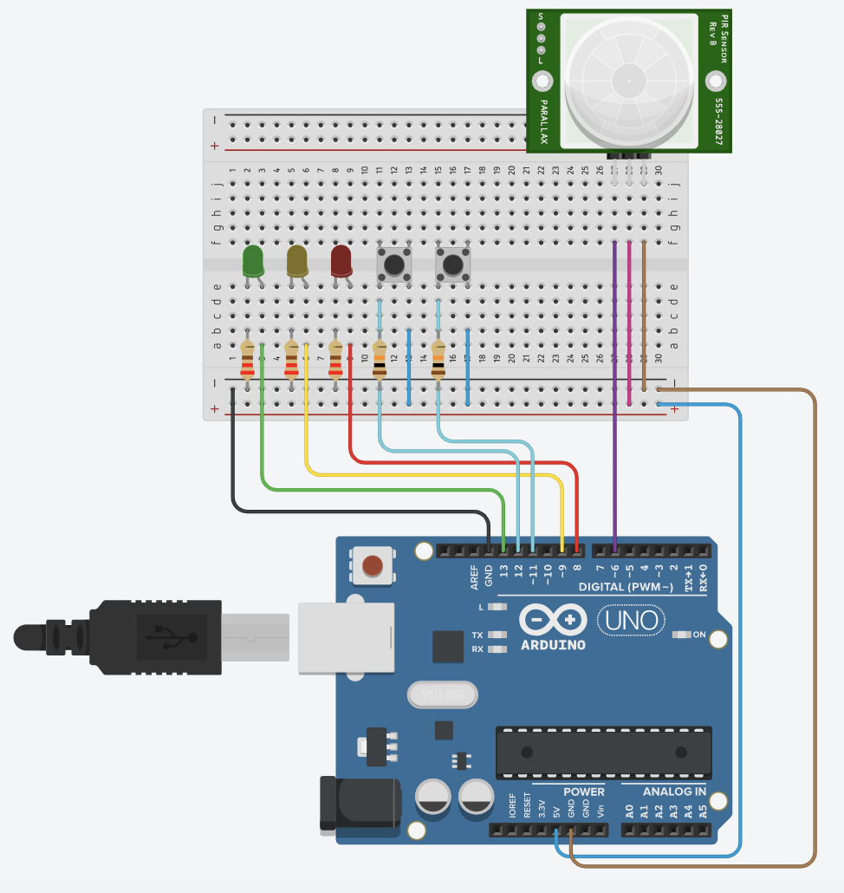

# ArduinoCircuit

 
Check out my simulator at TinkerCad [here](https://www.tinkercad.com/things/8tGgCndvjeP-hardwaresoftware-co-design-of-an-access-control-device).
     
## About the device
#### Sensors (with digital input)
- A passive infrared-sensor (PIR) for detecting the approach of a person (motion)
- Two pushbuttons for entering an entry code (the order is the code)

#### Actuators (with digital input)
- Three LEDs (red, yellow, green) for signalling state

#### Functions
The sensors and actuators are controlled by the software implemented in C++, which is running in the microprocesser. The software is implemented with the following behaviour:
- Initially, the system is `LOCKED`
- The red LED is on when the system is in a `LOCKED` state
- When motion is detected, the yellow LED is switched on; and the system is in a state `WAITING` for
  * The user to do two pushes on the buttons. After each push, the yellow LED will blink shortly
  * If the order is correct, then system will become `UNLOCKED`, and the green LED is switched on
  * If the order is incorrect, the red LED will blink and the system will go back to a `LOCKED` state

After a certain amount of time in the `UNLOCKED` state, the system will automatically enter the `LOCKED` state.
